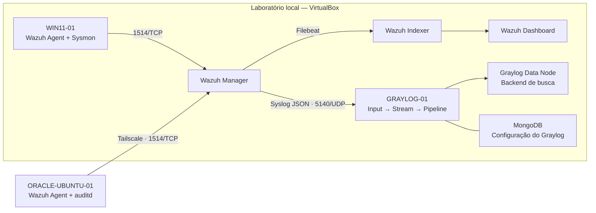

# Laboratório SIEM com Wazuh e Graylog

**Monitoramento de endpoints Windows e Linux, engenharia de detecção e processamento de alertas em um ambiente híbrido.**

**Autor:** Flávio Vinicius De Almeida Pesco  
**Contato:** [flavio.vpesco@gmail.com](mailto:flavio.vpesco@gmail.com) · [LinkedIn](https://www.linkedin.com/in/flavio-v-pesco/)

## Visão geral

Construí este laboratório para acompanhar o ciclo completo de um evento de segurança: sua geração no endpoint, coleta pelo agente, análise por regras, investigação no Wazuh e encaminhamento para pesquisa no Graylog.

O ambiente reuniu uma estação Windows local com Sysmon e um servidor Ubuntu na Oracle Cloud com auditd. O servidor remoto se conectou ao Wazuh por Tailscale. Na infraestrutura local, o Wazuh concentrou Manager, Indexer e Dashboard em uma VM; uma segunda VM executou Graylog, Data Node e MongoDB em containers.

O trabalho incluiu configuração de rede, integração de agentes, criação e ajuste de regras, testes benignos e diagnóstico de falhas de armazenamento, encadeamento de regras, interpretação de timestamps e parsing de JSON.

> Este repositório documenta resultados obtidos durante a construção do laboratório. Os exemplos de configuração foram reconstruídos a partir do registro técnico e não constituem um backup integral das VMs nem uma instalação automatizada. Não houve nova execução dos testes nas VMs durante a preparação deste write-up.

## Resultados

| Entrega | Validação registrada |
|---|---|
| Monitoramento Windows | Agente conectado e coleta do canal Sysmon confirmada |
| Monitoramento Linux remoto | Agente conectado ao Manager pela rede Tailscale |
| Regra `100100` | Notepad iniciado por PowerShell gerou alerta de nível 5 |
| Regra `100101` | PowerShell com comando codificado gerou alerta de nível 8 |
| Auditoria Linux | Escrita no arquivo de teste gerou alerta `80781`, nível 3 |
| Integração Wazuh → Graylog | Alertas recebidos por Syslog UDP e encaminhados ao stream dedicado |
| Parsing estruturado | Busca `wazuh_rule_id:100100` retornou evento após aplicação da regra final |

Os testes Windows foram classificados como **verdadeiros positivos benignos**: a atividade procurada ocorreu, mas foi gerada intencionalmente para validar a detecção. O resultado demonstra funcionamento dos casos testados; não mede cobertura geral contra ataques, taxa de falsos positivos ou desempenho em produção.

## Arquitetura



O Graylog recebeu uma cópia dos **alertas produzidos pelo Wazuh**, mantendo seu próprio backend. O fluxo não encaminhava automaticamente todos os eventos brutos dos endpoints. O Wazuh Dashboard permaneceu como interface de investigação do SIEM.

## Documentação

- [Write-up técnico: implementação, decisões e troubleshooting](docs/writeup.md)
- [Casos de detecção e procedimentos de validação](docs/deteccoes.md)
- [Configurações de referência](config/README.md)
- [Critérios de evidência e limites do projeto](docs/evidencias.md)
- [Referências técnicas oficiais](docs/referencias.md)

## Ambiente documentado

| Sistema | Papel | Recursos locais de referência |
|---|---|---|
| `Wazuh-SIEM` | Ubuntu Server, Wazuh all-in-one | 8 GB RAM, 4 vCPU, disco virtual de 60 GB |
| `WIN11-01` | Windows 11, Wazuh Agent e Sysmon | 6 GB RAM, 4 vCPU |
| `GRAYLOG-01` | Ubuntu Server, stack Graylog em Docker Compose | 6 GB RAM, 4 vCPU, disco virtual de 60 GB |
| `ORACLE-UBUNTU-01` | Ubuntu remoto, Wazuh Agent e auditd | Fora do orçamento de RAM do host local |

O host físico tinha **32 GB de RAM**. Uma segunda VM Windows chegou a ser registrada e testada, mas foi retirada para liberar recursos para o Graylog. A configuração final manteve dois endpoints monitorados: Windows local e Linux remoto.

O registro contém Wazuh 4.14.x, atualização do servidor para 4.14.7, agente Windows inicialmente em 4.14.6 e agente Oracle em 4.14.7. O stack Graylog utilizou imagens 7.1 e MongoDB 7.0. Essas são versões do ambiente histórico, não recomendações de versões atuais.

## Estrutura

```text
.
├── README.md
├── docs/
│   ├── writeup.md
│   ├── deteccoes.md
│   ├── evidencias.md
│   └── referencias.md
└── config/
    ├── README.md
    ├── wazuh/
    │   ├── local_rules.xml
    │   ├── windows-sysmon.xml
    │   ├── linux-audit.xml
    │   └── graylog-forwarding.xml
    └── graylog/
        └── parse-wazuh-json.rule
```

## Aprendizados e próximos passos

O principal aprendizado foi separar **geração, coleta, detecção, transporte, indexação e consulta**. Um evento ausente na busca não provava falha na coleta: em diferentes etapas, o motivo estava na regra final selecionada pelo Wazuh, no stream ou na interpretação do horário de origem.

Evoluções possíveis incluem persistir as regras de auditoria Linux, ampliar o parser, medir perdas e latência, definir retenção, realizar testes negativos e produzir novas capturas sanitizadas. Dashboards adicionais, enriquecimento de indicadores e automação de resposta permanecem como trabalhos futuros.

**Escopo:** laboratório educacional de segurança defensiva. Os comandos de validação devem ser executados somente em sistemas próprios ou autorizados.
